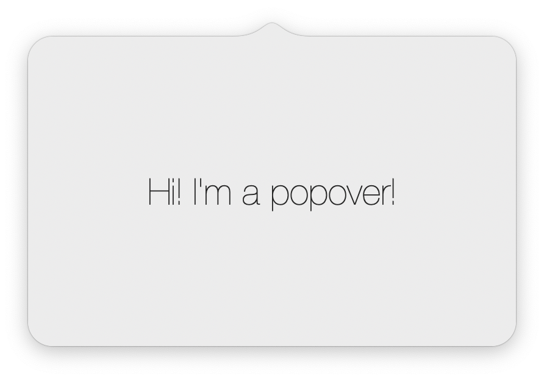

# Popover

Custom macOS popover.


# Install

Since this is a Swift Package, the installation process is pretty stright forward.

### Manual way
Update your `Package.swift` dependencies:

```
dependencies: [
    .package(url: "https://github.com/iSapozhnik/Popover", from: "1.0.8")
]
```

### Via Xcode:
1. Go to `File -> Swift Packages -> Add Package Dependency`. 
2. Put GitHub URL `https://github.com/iSapozhnik/Popover` and click `Next`
3. Select the latest version
4. Click `Finish`

# How to use

1. In your `AppDelegate` import Popover
2. Create a view you want to put into a status bar.
3. Create a content view controller which would be embedded inside Popover
4. Optionally create menu items
5. Create a Popover instance. Here you can use either standard configuration (you don't need to pass `windowConfiguration` parameter in this case) or you can subclass `DefaultConfiguration`, override some properties and pass a new instance as a parameter. If in step 4 you have created menu items, pass it here as well. You can see them by making right click on menu bar item. 
6. Call `prepare` to set everything up.

And here is how typical `AppDelegate` may look like:

```swift
import Cocoa
import Popover

class MyPopoverConfiguration: DefaultConfiguration {
    override var backgroundColor: NSColor {
        return NSColor.systemRed
    }

    override var borderColor: NSColor? {
        return NSColor.red
    }
}

@NSApplicationMain
class AppDelegate: NSObject, NSApplicationDelegate {
    var popover: Popover!

    func applicationDidFinishLaunching(_ aNotification: Notification) {
        let statusItemView = StatusItemView(frame: NSRect(width: 22.0, height: 20))

        let viewController = MainViewController()

        let menuItems: [Popover.MenuItemType] = [
            .item(Popover.MenuItem(title: "Settings", action: viewController.showSettings)),
            .separator,
            .item(Popover.MenuItem(title: "Quit", key: "q", action: viewController.quit))
        ]

        popover = Popover(with: MyPopoverConfiguration(), menuItems: menuItems)
        popover.prepare(with: statusItemView, contentViewController: viewController)
    }
}

```

# What can be customized?

Quite a lot of things:

```swift
public protocol PopoverConfiguration {
    /// The distance from Popover's arrow to a status item.
    var popoverToStatusItemMargin:  CGFloat { get }

    /// Popover's background color.
    var backgroundColor:            NSColor { get }

    /// Popover's border color.
    /// - Important:
    ///     If `borderColor` returns `nil`, settings `borderWidth` won't make any effect. See also: `borderWidth`.
    var borderColor:                NSColor? { get }

    /// Popover's border width.
    /// - Important:
    ///      If Popover's border color is set to `nil`, setting `borderWidth` won't make any effect.
    var borderWidth:                CGFloat { get }

    /// Defines Popover arrow height.
    var arrowHeight:                CGFloat { get }

    /// Defines Popover arrow width.
    var arrowWidth:                 CGFloat { get }

    /// Defines Popover corner radius.
    /// - Warning:
    ///     If this value is too big and if the Popover's status item (menu bar view) is too close to the right edge, the appearence of the Popover might be odd.
    var cornerRadius:               CGFloat { get }

    /// Defines Popover content edge insets.
    var contentEdgeInsets:          NSEdgeInsets { get }

    /// The distance from the right side of the Popover to the screen's edge.
    /// - Warning:
    ///     If this value is too big and if the Popover's status item (menu bar view) is too close to the right edge, the appearence of the Popover might be odd.
    var rightEdgeMargin:            CGFloat { get }
}
```


Heavily inspired by [CCNStatusItem](https://github.com/phranck/CCNStatusItem)
